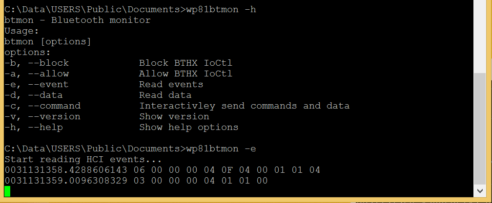

# wp81btmon

Attempt to create an equivalent of some of the [Bluez tools](https://github.com/bluez/bluez/wiki/btmon) for Windows Phone 8.1  
Currently, the executable *wp81btmon* can block the IOCtls going to/from the Windows Bluetooth stack, listen to HCI events sent by the Qualcomm Bluetooth stack, and send commands to the Qualcomm Bluetooth stack.  

> [!WARNING]
> Currently only compatible with Nokia Lumia 520.  

## Usage




> [!NOTE]
> The timestamp H.L printed by the options `-e` and `-c` is the [high and low DateTime](https://learn.microsoft.com/en-us/windows/win32/api/minwinbase/ns-minwinbase-filetime)
> at the moment of the reading or writing of the HCI message.  

> [!NOTE]
> In case of error, check the Bluetooth is activated on the phone. And check the driver *wp81controldevice.sys* is started.

## Deployment

- [Install a telnet server on the phone](https://github.com/fredericGette/wp81documentation/tree/main/telnetOverUsb#readme), in order to run the application.  
- Manually copy the executable from the root of this GitHub repository to the shared folder of the phone.
> [!NOTE]
> When you connect your phone with a USB cable, this folder is visible in the Explorer of your computer. And in the phone, this folder is mounted in `C:\Data\USERS\Public\Documents`  

### Installation of the kernel drivers "wp81controldevice.sys" and "wp81hcifilter.sys"

#### Legacy driver "wp81controldevice.sys"

This driver allows communication between the *wp81btmon* executable and the filter driver.

- Manually copy the .sys from the driver folder of this GitHub repository to the shared folder of the phone.
- Install the driver:
```
sc create wp81controldevice type= kernel binPath= C:\Data\USERS\Public\Documents\wp81controldevice.sys
```
- Start the driver:
```
sc start wp81controldevice
```

> [!NOTE]
> You have to start the control driver after every reboot of the phone.  

#### Filter driver "wp81hcifilter.sys"

This driver filters the IOCtls exchanged between the Windows Bluetooth stack and the Qualcomm Bluetooth stack.

- Manually copy the .sys from the driver folder of this GitHub repository to the shared folder of the phone.
- Install the driver:
```
reg ADD "HKLM\SYSTEM\CurrentControlSet\Services\wp81hcifilter"
reg ADD "HKLM\SYSTEM\CurrentControlSet\Services\wp81hcifilter" /V Description /T REG_SZ /D "WP81 HCI Filter driver"
reg ADD "HKLM\SYSTEM\CurrentControlSet\Services\wp81hcifilter" /V DisplayName /T REG_SZ /D "wp81HCIFilter"
reg ADD "HKLM\SYSTEM\CurrentControlSet\Services\wp81hcifilter" /V ErrorControl /T REG_DWORD /D 1
reg ADD "HKLM\SYSTEM\CurrentControlSet\Services\wp81hcifilter" /V Start /T REG_DWORD /D 3
reg ADD "HKLM\SYSTEM\CurrentControlSet\Services\wp81hcifilter" /V Type /T REG_DWORD /D 1
reg ADD "HKLM\SYSTEM\CurrentControlSet\Services\wp81hcifilter" /V ImagePath /T REG_EXPAND_SZ  /D  "\??\C:\Data\USERS\Public\Documents\wp81hcifilter.sys"
reg ADD "HKLM\System\CurrentControlSet\Enum\SystemBusQc\SMD_BT\4&315a27b&0&4097" /V LowerFilters /T REG_MULTI_SZ /D "wp81hcifilter"
```
- Start the driver:
```
powertool -reboot
```

> [!NOTE]
> The filter driver automatically starts when the Bluetooth stack boots (ie when the phone boots and Bluetooth is enabled).

> [!NOTE]
> You can inspect the logs of the drivers using [wp81debug](https://github.com/fredericGette/wp81debug)  
> `wp81debug.exe dbgprint | findstr /C:"Control!" /C:"HCI!"`  

## Compilation

- [Visual Studio 2015 with the Windows Phone SDK](https://github.com/fredericGette/wp81documentation/blob/main/ConsoleApplicationBuilding/README.md).  
- [Windows Phone Driver Kit](https://github.com/fredericGette/wp81documentation/blob/main/DriverBuilding/README.md).  
